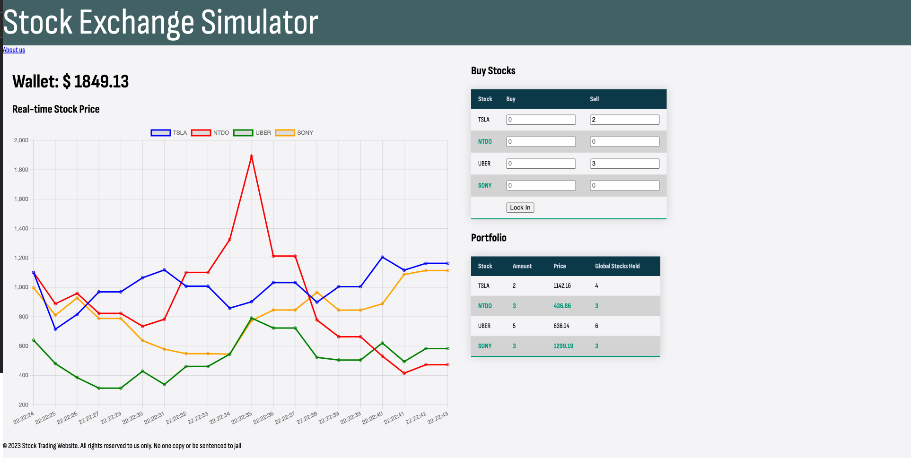
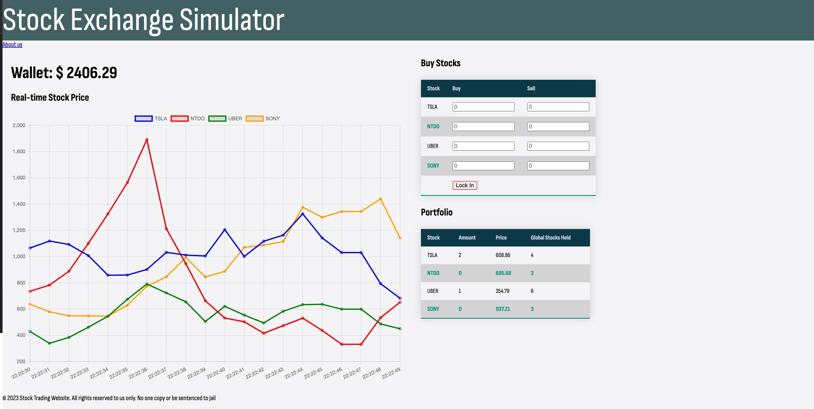

# Stock Exchange Simulator - Final Project
> Course: CSCI 2020U: Software Systems Development and Integration

## Project Information
Have you ever wanted to practice trading stocks without the risk of losing real money? Our team created 
a multi-user stock trading service, where different clients can connect to purchase 
shares of 4 different stocks. These stocks each increase or decrease periodically, and in between these updates, 
users can buy or sell their stocks. Users are also able to see the amount of shares held for each stock 
between all users. This server may also serve as a great educational resource to teach students the basics 
of stocks in the education system. We also included a link to an 'About us' page, which has clickable links 
with each of our team members' GitHub profile attached.

Collaborators: Daniel Zajac, Heisn Nithysingha, David Garcia, Anthony Fung

Youtube video link: https://youtu.be/aQ0swo4aAUk

> Stock Server Client 1 perspective:

> Stock Server Client 2 perspective:

### How to run
- To run this project, you must first install IntelliJ IDEA, GlassFish 7.0.0 (or similar versions) and git.
- First, navigate to our GitHub repository at
  https://github.com/OntarioTech-CS-program/w23-csci2020u-project-team25. Select the 'code'
  dropdown menu, and copy the HTTPS link under the 'clone' tab.
- Then, open any supported shell of your choice, and navigate to your desired directory, where you will clone the project.
- Type 'git clone *link*', where *link* represents the HTTPS link you copied from our repository.
- Now, inside our repository, you will see a 'FinalAssignment' folder, which you must open in IntelliJ.
  Note: You must not open the entire repository in IntelliJ, you must SPECIFICALLY open the 'FinalAssignment' folder.
  You will see a pop-up in the bottom right asking you to load a maven build script, where you click the 'Load Maven Project' button.
- To run the local server, you must first configure glassfish. To do this, click 'Edit Configurations' in the top right
  of IntelliJ, then click 'Add Configuration' and select GlassFish local. In the menu that pops up, type domain1 into the
  domain entry box, then switch to the 'Deployment' tab and select 'Artifact' then choose 'FinalAssignment:war exploded'.
- At this point, you can click the green arrow near the top right to run the local server.
- When the server loads, IntelliJ will launch our stock exchange website in either your most recently opened browser, or your
  default browser.
- If you wish to simulate a multi-user experience on a local GlassFish server, you can also duplicate the stock exchange 
  tab within your browser.

### External Resources
Aside from the default dependencies in the maven project, Jakarta dependencies, such as websocket and servlet 
dependencies were used to handle the socket connections and requests within our program, as well as api calls. \We also used the json library
to parse and create json objects. The code for using these dependencies can be copied from the 'pom.xml' file within our project files.

[1] https://mvnrepository.com/artifact/jakarta.servlet/jakarta.servlet-api

[2] https://mvnrepository.com/artifact/jakarta.websocket/jakarta.websocket-api

[3] https://mvnrepository.com/artifact/org.json/json

[4] https://mvnrepository.com/artifact/jakarta.ws.rs